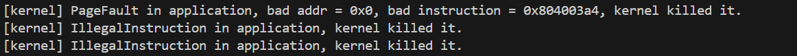

# 第3章 Lab1 实验报告

2023012134 王振宇

## 功能实现

实现了 `sys_trace`（系统调用号 410）。在`TaskManagerInner` 的 task 列表类型 `TaskControlBlock` 中新增了大小为 512 的系统调用计数数组，每次进入 `syscall` 分发函数时先对对应编号的计数加一，再执行实际调用。
  
`sys_trace` 根据 `trace_request` 的值执行三种操作：为 0 时将 `id` 作为用户态地址读取一个字节并返回；为 1 时将 `data` 的低 8 位写入 `id` 所指地址；为 2 时查询当前任务调用编号为 `id` 的系统调用次数（本次调用已计入）并返回；其余情况返回 -1。

## 简答题
1. 运行三个测试程序后输出如图

| 输出行 | 测例 | 出错原因 |
|---|---|---|
| PageFault in application, bad addr = 0x0 | ch2b_bad_address | U 态向地址 `0x0` 写数据，触发 Store PageFault |
| IllegalInstruction in application（第1次） | ch2b_bad_instructions | U 态执行 `sret`（S 态特权指令），触发非法指令异常 |
| IllegalInstruction in application（第2次） | ch2b_bad_register | U 态执行 `csrr sstatus`（访问 S 态 CSR 寄存器），触发非法指令异常 |

sbi版本：[rustsbi] RustSBI version 0.3.0-alpha.2, adapting to RISC-V SBI v1.0.0

---

2. 

(1) L40：刚进入 `__restore` 时，sp 代表了什么值。请指出 `__restore` 的两种使用情景。

刚进入 `__restore` 时，sp 指向内核栈上已分配的 TrapContext 的顶部（即 `sp` 指向内核栈中保存了完整上下文的那块区域的起始处）。

两种使用情景：
- 一（trap 返回）：从用户态发生异常/系统调用，经 `__alltraps` 保存上下文并调用 `trap_handler` 处理完毕后，使用 `__restore` 从保存在内核栈上的 Trap 上下文恢复寄存器并返回用户程序继续执行。
- 二（首次启动任务）：在第一次调度某个任务时，内核为其预先在内核栈上构造好一个初始 TrapContext（通过 `goto_restore` 和 `init_app_cx`），然后直接跳转到 `__restore` 执行，让寄存器到达启动应用程序所需要的上下文状态，使 CPU 第一次进入用户态开始运行该任务。

---

(2) L43-L48：这几行汇编代码特殊处理了哪些寄存器？对进入用户态有何意义？

这几行从 TrapContext 中恢复了三个控制状态寄存器：

- `sstatus`（t0）：其 SPP 字段记录了 trap 发生前的特权级。执行 `sret` 时，CPU 根据 SPP 决定返回哪个特权级，若 SPP=0 则进入 U 态。必须在 `sret` 前恢复此寄存器，才能正确返回用户态。
- `sepc`（t1）：保存了 trap 发生时用户程序的 PC（即 `ecall` 指令的地址）。`sret` 执行后，PC 被设置为 `sepc` 的值，使用户程序从正确位置继续执行。
- `sscratch`（t2）：恢复为用户栈指针。在最后的 `csrrw sp, sscratch, sp` 执行后，sp 将变成用户栈指针，sscratch 则保存内核栈指针，为下次 trap 做准备。

---

(3) L50-L56：为何跳过了 x2（sp）和 x4（tp）？

- x2（sp）：此时 sp 仍指向内核栈上的 TrapContext，必须保留以继续从中读取剩余寄存器。用户栈指针的恢复由 L60 的 `csrrw sp, sscratch, sp` 完成，而不是在此直接 `ld x2`。
- x4（tp）：tp（thread pointer）按约定由运行时/内核自行管理，用户程序通常不使用，因此 TrapContext 中没有保存 tp，此处直接跳过。

---

(4) L60：该指令之后，sp 和 sscratch 中的值分别有什么意义？

`csrrw sp, sscratch, sp` 将 sp 与 sscratch 互换，执行后：

- sp：变为用户栈指针（原存于 sscratch 中，即进入 trap 前用户程序使用的栈顶），用户程序将从该栈继续运行。
- sscratch：变为内核栈指针（原来的 sp，即释放 TrapContext 后的内核栈顶），供下次发生 trap 时 `__alltraps` 的第一条 `csrrw` 使用，切换到内核栈。

---

(5) `__restore` 中发生状态切换在哪一条指令？为何该指令执行之后会进入用户态？

状态切换发生在 `sret` 指令。

执行 `sret` 时，CPU 硬件自动完成以下操作：将特权级切换为 `sstatus.SPP` 字段所指定的模式（已在 L46 恢复为 U 态对应的值 0），并将 PC 跳转到 `sepc` 中保存的用户程序地址。因此 `sret` 执行之后，CPU 即处于 U 态并从用户程序的断点处继续运行。

---

(6) L13：该指令之后，sp 和 sscratch 中的值分别有什么意义？

`__alltraps` 的第一条 `csrrw sp, sscratch, sp` 执行后：

- sp：变为内核栈指针（原 sscratch 中保存的值），后续在内核栈上分配 TrapContext 并保存上下文。
- sscratch：变为用户栈指针（原 sp 的值，即 trap 发生时用户程序正在使用的栈顶），待 `__restore` 时再恢复给 sp。

---

(7) 从 U 态进入 S 态是哪一条指令发生的？

从 U 态进入 S 态由用户程序执行 **`ecall`** 指令触发。

## Honor Code

